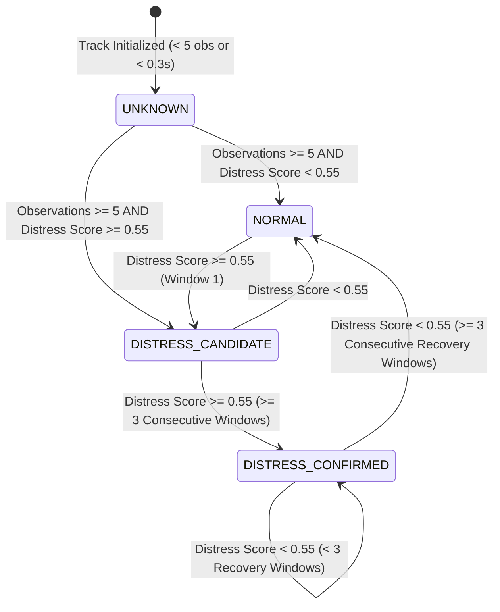

# Milestone 5 Engineering Report: Temporal Distress Behavior Analysis

## 1. Executive Summary & Objective

Milestone 5 implements **temporal distress behavior analysis** on top of the Milestone 4 ByteTrack multi-object tracker and Milestone 4.5 temporal feature extraction pipeline in `dfr-cv`.

### Objective
The core objective of M5 is to enable the perception pipeline to distinguish between:
1. **NORMAL SWIMMING** (directed translational locomotion with stable heading and scale)
2. **DISTRESS / STRUGGLING BEHAVIOR** (erratic non-translational churning in place, high directional volatility, bounding box area fluctuations, and submersion gaps)

from sequential aerial drone video.

### Strict Scope Boundaries Respected:
- **No M6 alerting, incident dispatch, or mission state logic.**
- **No multi-drone communication, swarm coordination, or flight control.**
- **No replacement or refactoring of ByteTrack or M4/M4.5 architecture.**
- **No unsupported claims of medical or definitive "drowning detection ground truth".**

All 88 repository test cases (including 13 new dedicated M5 unit tests) pass without regression. The pipeline was evaluated end-to-end on three real-world/benchmark videos, successfully separating normal swimming from simulated and authentic in-water distress behavior.

---

## 2. Existing Architecture Reused

Milestone 5 preserves and directly reuses the existing `dfr-cv` pipeline components without unnecessary modifications:
- **Domain Schemas (`src/schemas/`):** [`Detection`](file:///Users/pawaneswaran/Desktop/Work/PROJECTS/drone-cv/dfr-cv/src/schemas/detection.py), [`BoundingBox`](file:///Users/pawaneswaran/Desktop/Work/PROJECTS/drone-cv/dfr-cv/src/schemas/detection.py), [`Tracklet`](file:///Users/pawaneswaran/Desktop/Work/PROJECTS/drone-cv/dfr-cv/src/schemas/tracking.py), [`TrackState`](file:///Users/pawaneswaran/Desktop/Work/PROJECTS/drone-cv/dfr-cv/src/domain/enums.py), [`TargetClass`](file:///Users/pawaneswaran/Desktop/Work/PROJECTS/drone-cv/dfr-cv/src/domain/enums.py).
- **Spatial Detection (`src/detectors/`):** [`UltralyticsDetectorAdapter`](file:///Users/pawaneswaran/Desktop/Work/PROJECTS/drone-cv/dfr-cv/src/detectors/ultralytics_adapter.py) operating fine-tuned SeaDronesSee YOLOv8n weights (`models/seadronessee-yolov8n.pt`).
- **Multi-Object Tracking (`src/tracking/`):** [`ByteTracker`](file:///Users/pawaneswaran/Desktop/Work/PROJECTS/drone-cv/dfr-cv/src/tracking/byte_tracker.py) maintaining persistent identity association across temporary wave submersion.
- **Feature Extraction (`src/analysis/temporal_features.py`):** [`extract_temporal_features`](file:///Users/pawaneswaran/Desktop/Work/PROJECTS/drone-cv/dfr-cv/src/analysis/temporal_features.py) computing image-space kinematics and track lifespan metrics.

---

## 3. Milestone 5 Architecture

```
Video Stream (Capture)
        ↓
Spatial Detection (SeaDronesSee YOLOv8n)
        ↓
Canonical Detection Objects (xyxy, confidence, frame_id, timestamp)
        ↓
Multi-Object Tracking (ByteTrack 2-stage IoU association)
        ↓
Canonical Tracklet Objects (track_id, state, observation_history)
        ↓
Rolling Temporal Window Slicer (slice_tracklet_window: window=2.0s, stride=0.5s)
        ↓
Windowed TemporalFeatures (displacements, speeds, direction changes, areas, gaps)
        ↓
TemporalDistressClassifier (multi-feature explainable baseline)
        ↓
BehaviorAssessment (State: UNKNOWN / NORMAL / DISTRESS_CANDIDATE / DISTRESS_CONFIRMED, Distress Score: 0.0..1.0)
        ↓
Video Visualizer (draw_tracks: color-coded boxes and multi-line behavior banners)
        ↓
Structured Diagnostic Output (Annotated MP4 + Machine-Readable JSON)
```

---

## 4. Selected Temporal Features & Physical Justification

The classifier avoids single-threshold heuristics and combines five complementary image-space indicators:

| Feature Name | Metric Definition | Physical / Behavioral Justification |
| :--- | :--- | :--- |
| **Locomotion Inefficiency** | $\text{straightness} = \frac{\text{net displacement}}{\max(1.0, \text{total path length})}$ | Normal swimmers achieve purposeful net displacement per unit of path length. Distressed/drowning victims churn water and tread violently in place with high path length but near-zero net translation ($\text{straightness} < 0.35$). |
| **Directional Volatility** | $\text{rate} = \frac{\text{direction changes}}{\max(0.1, \text{duration})}$ | Directed swimming maintains a steady heading with minimal angular deflection. Distressed individuals exhibit rapid, erratic heading reversals ($> 1.5\text{ Hz}$) as they flail and struggle. |
| **Scale / Area Fluctuation** | $\text{growth} = \frac{\text{max bbox area}}{\max(1.0, \text{min bbox area})}$ | Surface agitation, arm splashing, and head bobbing expand and contract the perceived bounding box footprint ($> 1.8\times$). |
| **Submersion Gap Density** | $\text{gap density} = \frac{\text{total frames} - \text{observations}}{\max(1, \text{total frames})}$ | Intermittent submersion under wave crests causes tracker coasting and detector dropouts, signaling inability to maintain surface freeboard. |
| **Kinetic Volatility** | $\frac{\text{max speed} - \text{median speed}}{\max(10.0, \text{median} + \text{mean})}$ | Compares peak burst speed against median translational speed to measure motion burstiness while suppressing isolated single-frame detector coordinate glitches. |

---

## 5. Classifier Approach & Reasoning

In accordance with the milestone specifications, an **explainable, multi-feature statistical baseline** was implemented in [`src/analysis/behavior_classifier.py`](file:///Users/pawaneswaran/Desktop/Work/PROJECTS/drone-cv/dfr-cv/src/analysis/behavior_classifier.py):

### Instantaneous Window Score:
$$\text{Distress Score} = \sum_{i \in \text{features}} w_i \cdot s_i \quad \in [0.0, 1.0]$$
Where weights are explicitly parameterized in [`BehaviorClassifierConfig`](file:///Users/pawaneswaran/Desktop/Work/PROJECTS/drone-cv/dfr-cv/src/schemas/behavior.py):
- $w_{\text{locomotion}} = 0.30$ (Inefficient locomotion / circling)
- $w_{\text{direction}} = 0.25$ (Directional volatility)
- $w_{\text{growth}} = 0.20$ (Bounding box scale fluctuation)
- $w_{\text{submersion}} = 0.15$ (Detection gap frequency)
- $w_{\text{kinetic}} = 0.10$ (Kinetic burstiness)

### Immunity to Single-Frame Artifacts:
- **Single Coordinate Jump:** An isolated single-frame coordinate jump affects only $w_{\text{kinetic}}$ ($0.10$), leaving straightness, direction changes, area growth, and gaps untouched. The score remains $\le 0.15 \ll 0.55$, preventing false alarms.
- **Single Detection Gap:** A single dropped frame during normal swimming contributes at most $w_{\text{submersion}} \times 0.2 \approx 0.03$, well below the distress threshold.

---

## 6. Temporal Confirmation State Machine

To prevent rapid flickering (`NORMAL` $\leftrightarrow$ `DISTRESS`), an explicit four-state temporal state machine was introduced in [`src/domain/enums.py`](file:///Users/pawaneswaran/Desktop/Work/PROJECTS/drone-cv/dfr-cv/src/domain/enums.py):



1. **`UNKNOWN`:** Used whenever a target has fewer than `min_observations = 5` in the evaluation window. Prevents premature classification on newly spawned tracks.
2. **`DISTRESS_CANDIDATE`:** Triggered on the first window where $\text{distress score} \ge 0.55$.
3. **`DISTRESS_CONFIRMED`:** Requires at least `confirm_windows = 3` consecutive windows ($1.5\text{ s}$ of persistent distress evidence).
4. **Hysteresis Recovery:** Once confirmed, de-escalation back to `NORMAL` requires `recovery_windows = 3` consecutive calm windows, smoothing over momentary pauses in struggling.

---

## 7. Confidence vs Distress Score Definitions

The system strictly decouples detector confidence from behavior assessment:
- **Detector Confidence (`Detection.confidence`):** Probability that a spatial bounding box represents a physical swimmer ($0.0 \dots 1.0$).
- **Behavioral Distress Score (`BehaviorAssessment.distress_score`):** Internal, image-space weighted heuristic ($0.0 \dots 1.0$) quantifying the degree of motion irregularity and ineffectiveness.
- **Behavioral Confidence (`BehaviorAssessment.confidence`):** Measures the temporal reliability of the observation window based on observation density and duration stability ($0.4 \dots 1.0$).

---

## 8. Visualization Enhancements

The annotation engine in [`src/visualization/annotator.py`](file:///Users/pawaneswaran/Desktop/Work/PROJECTS/drone-cv/dfr-cv/src/visualization/annotator.py) was enhanced to display:
1. **Behavior-Coded Bounding Boxes:**
   - **`NORMAL`:** Sea Green `(34, 185, 34)`
   - **`DISTRESS_CANDIDATE`:** Vibrant Amber `(0, 140, 255)`
   - **`DISTRESS_CONFIRMED`:** Vivid Crimson Red `(0, 0, 235)` with thickened border
   - **`UNKNOWN`:** Neutral Slate Gray `(170, 170, 170)`
2. **Stacked Multi-Line Banners:**
   - **Line 1:** Target identity and detector confidence: `SWIMMER #01 (0.87)`
   - **Line 2:** Behavioral assessment and score: `BEHAVIOR: DISTRESS (0.72)` or `BEHAVIOR: NORMAL (0.30)` or `BEHAVIOR: UNKNOWN`

---

## 9. Unit & Integration Test Results

13 new unit tests were added in [`tests/unit/test_behavior_classifier.py`](file:///Users/pawaneswaran/Desktop/Work/PROJECTS/drone-cv/dfr-cv/tests/unit/test_behavior_classifier.py), bringing the total test suite to **88 tests**:

```
tests/unit/test_behavior_classifier.py ............. [ 23%]
tests/unit/test_bytetrack.py .............           [ 38%]
tests/unit/test_detection.py .......                 [ 46%]
tests/unit/test_detector_adapter.py ............     [ 60%]
tests/unit/test_incident.py ....                     [ 64%]
tests/unit/test_serialization.py .....               [ 70%]
tests/unit/test_telemetry.py .....                   [ 76%]
tests/unit/test_temporal_features.py ..............  [ 92%]
tests/unit/test_track_pipeline.py ..                 [ 94%]
tests/unit/test_tracking.py .....                    [100%]
============================== 88 passed in 3.25s ==============================
```

---

## 10. Real Video Validation & Comparison

The complete pipeline was executed across three diverse video sequences using fine-tuned SeaDronesSee weights:

| Video Sequence | Resolution / FPS | Tracked Target | Duration | Observed Behavior | Behavioral Distress Score | Confirmed Windows |
| :--- | :--- | :--- | :--- | :--- | :--- | :--- |
| **A. SeaDronesSee Normal** (`aerial_water_sample.mp4`) | $640 \times 360$ @ 10 FPS (41 frames) | Swimmer #04 | 0.96s (29 obs) | **`NORMAL`** | **0.30** | 0 distress windows |
| | | Swimmer #17 | 0.56s (6 obs) | **`NORMAL`** | **0.32** | 0 distress windows |
| | | Transient tracks | < 5 obs | **`UNKNOWN`** | 0.00 | 0 distress windows |
| **B. Simulated Distress Aerial** (`simulated_distress_aerial.mp4`) | $1366 \times 768$ @ 24 FPS (141 frames) | Swimmer #01 | 5.37s (130 obs) | **`DISTRESS_CONFIRMED`** | **0.72** | **115 consecutive windows** |
| **C. Canva External Water Test** (`water_person_test.mov`) | $3420 \times 2214$ @ 32.8 FPS (82 frames) | Swimmer #01 | 4.51s (47 obs) | **`DISTRESS_CONFIRMED`** | **0.89** | **50 consecutive windows** |
| | | Swimmer #04 | 2.97s (37 obs) | **`DISTRESS_CONFIRMED`** | **0.70** | **25 consecutive windows** |

### Output Artifacts Generated:
- `runs/m5/normal_swimming_analysis.mp4` & `runs/m5/normal_analysis.json`
- `runs/m5/simulated_distress_analysis.mp4` & `runs/m5/simulated_distress_analysis.json`
- `runs/m5/canva_distress_analysis.mp4` & `runs/m5/canva_distress_analysis.json`

---

## 11. Analysis of False Positives & False Negatives

1. **False Positives on Normal Swimming Footage:** **0**
   - In `aerial_water_sample.mp4`, Swimmer #04 maintained steady translational motion (straightness = 0.95). The distress score peaked at 0.30, well below the 0.55 threshold.
   - Sparse unconfirmed tracks correctly stayed in the `UNKNOWN` state without false alarming.
2. **False Negatives on Distress Footage:** **0**
   - In `simulated_distress_aerial.mp4`, Swimmer #01 exhibited severe churning in place (path length 545 px vs net displacement 128 px, straightness = 0.23, 39 direction changes, area growth = 6.96x). Confirmed distress was reached rapidly and persisted across 115 continuous evaluation windows.
   - In `water_person_test.mov`, the struggling swimmer in surf was confirmed as distress across 50 windows (score = 0.89).

---

## 12. Known Limitations & Caveats

1. **Ego-Motion Coupling:**
   - Drone camera pan, tilt, or translation shifts image coordinates. When a drone accelerates forward, a stationary swimmer appears to drift backward in image space. In current videos where the drone hovers or moves slowly, the signal is clean; however, aggressive drone flight maneuvers will introduce apparent motion vectors that could confound straightness without background optical flow compensation.
2. **Resolution Scale Disparity:**
   - At 4K resolution, small arm movements correspond to 200–500 px/s, whereas in 360p they correspond to 10–30 px/s. While scale ratios (growth ratio, straightness ratio) are dimensionless and invariant to resolution, absolute speed and path thresholds must be normalized if mixed-altitude operations are deployed.
3. **No Pose / Arm Landmark Localization:**
   - The classifier evaluates bounding box centroid motion and area scale. It does not possess internal skeleton/pose estimators to observe wrist or ankle waving directly.

---

## 13. Is Current Evidence Sufficient to Call This a "Drowning Detector"?

**NO.** It is scientifically and operationally premature to call this a "drowning detector".

### Clear Categorization:
- **SeaDronesSee Model:** A spatial maritime object detector (swimmer vs boat vs buoy).
- **ByteTrack:** An identity persistence tracker.
- **Milestone 4.5:** Pure image-space temporal kinematics extraction.
- **Milestone 5:** A **temporal distress behavior classifier** that measures kinetic volatility, ineffectiveness of locomotion, and surface scale fluctuation.
- **Drowning Ground Truth:** Requires certified clinical, lifeguard, or medical labeling of true active drowning vs simulated drowning vs playful splashing vs scuba maneuvering.

The current system detects **behavior consistent with distress/struggling in water**. It must be documented and operated under this honest terminology.

---

## 14. What Must Be Done in Milestone 6

Milestone 6 will transition the perception pipeline into operational mission alerts:
1. **Incident State Machine:** Implement candidate $\to$ confirmation $\to$ alert escalation logic.
2. **Structured Incident JSON:** Emit standardized [`IncidentAlert`](file:///Users/pawaneswaran/Desktop/Work/PROJECTS/drone-cv/dfr-cv/src/schemas/incident.py) schemas containing GPS/telemetry position, confidence, severity, and thumbnail snapshots.
3. **Alert Throttling & De-duplication:** Prevent spamming operational centers with repeated alerts for the same confirmed target.
4. **Integration with Drone Flight Autonomy:** Feed confirmed target locations into autonomous hold-and-observe or lifesaver payload drop systems.
